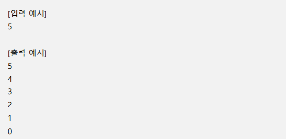

### 1. 세로로 출력하기 

#### 자연수 number를 입력 받아, 1부터 number까지의 수를 세로로 한줄씩 출력하시오.


``` python
num = int(input())

for i in range(1, num + 1):
    print(i)
```

----


### 2. 거꾸로 세로로 출력하기 

#### 자연수 number를 입력 받아, number부터 0까지의 수를 세로로 한줄씩 출력하시오.



``` python
num = int(input())

for i in range(num,-1,-1):
    print(i)
```

----


### 3. N줄 덧셈 (SWEA #2025) 

#### 입력으로 자연수 number가 주어질 때, 1부터 주어진 자연수 number까지를 모두 더한 값 을 출력하시오. 단, 주어지는 숫자는 10000을 넘지 않는다. 예를 들어, 주어진 숫자가 10일 경우 1 + 2 + 3 + 4 + 5 + 6 + 7 + 8 + 9 + 10 = 55이므로, 출력해야 할 값은 55이다.


``` python
num = int(input())
sum = 0

for i in range(1, num + 1):
    sum = sum + i
print(sum)
```

