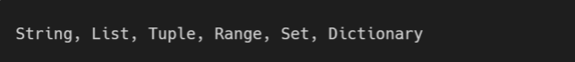
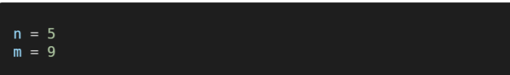
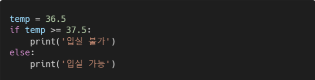
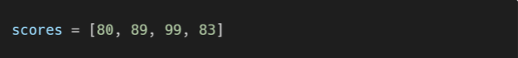

### 1. Mutable & Immutable 

#### 주어진 컨테이너들을 각각 변경 가능한 것(mutable)과 변경 불가능한 것(immutable)으로 분류하시오.



``` python
#mutable(변경 가능한 것)
List
set

#immutable(변경 불가능한 것)
string
Tuple
Range
dictionary(key는 immutable만 활용 가능)

```

----


### 2. 홀수만 담기

#### range와 slicing을 활용하여 1부터 50까지의 숫자 중, 홀수로만 이루어진 리스트를 만드시오.

``` python
list(range(1,51))[::2]
```

----


### 3. Dictionary 만들기

#### 반 학생들의 정보를 이용하여 key는 이름, value는 나이인 dictionary를 만드시오.


### 4. 반복문으로 네모 출력

####  두 개의 정수 n과 m이 주어졌을 때, 가로의 길이가 n, 세로의 길이가 m인 직사각형 형태를 별(*) 문자를 이용하여 출력하시오. 단, 반복문을 사용하여 작성하시오



``` python
n = 5
m = 9

for i in range (1, int(m)+1):
    print('*'*int(n))
```

----


### 5. 조건 표현식

#### 주어진 코드의 조건문을 조건 표현식으로 바꾸어 작성하시오.



``` python
print('입실 불가') if num 
```


### 6. 평균 구하기

####  주어진 list에 담긴 숫자들의 평균값을 출력하시오.

