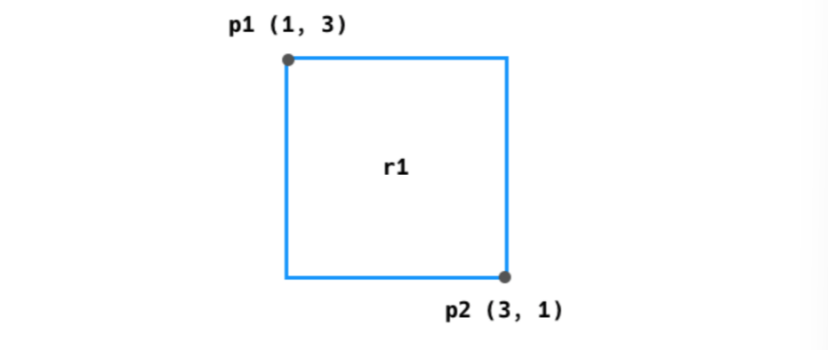

# WorkShop

### 도형 만들기 아래의 명세를 읽고 Python 클래스를 활용하여 점(Point)과 사각형(Rectangle)을 표현하시오.

Point 클래스에 대한 명세는 다음과 같다.

| 인스턴스 변수 | 타입 | 설명   |
| ------------- | ---- | ------ |
| x             | int  | x 좌표 |
| y             | int  | y 좌표 |

|  메서드  | 매개변수       | 반환값(타입) |                             설명                             |
| :------: | -------------- | ------------ | :----------------------------------------------------------: |
| (생성자) | x 좌표, y 좌표 | 없음         | 인스턴스가 생성될 때, 전달 받은 int 값들로 인스턴스 변수 x와 y를 초기화 한다. |

예를 들어 좌표(4, 3)의 점은 아래와 같이 표현할 수 있다. 

``` python
p1 = Point(4, 3)
```


Rectangle 클래스에 대한 명세는 다음과 같다.

| 인스턴스 변수 | 타입           | 설명           |
| ------------- | -------------- | -------------- |
| p1            | point 인스턴스 | 좌측 상단 좌표 |
| p2            | point 인스턴스 | 우측 하단 좌표 |


|    메서드     |            매개변수            |    반환값(타입)     |                             설명                             |
| :-----------: | :----------------------------: | :-----------------: | :----------------------------------------------------------: |
|   (생성자)    | point 인스턴스, point 인스턴스 |        없음         | 인스턴스가 생성될 때 2개의 point 인스턴스를 전달 받아, 인스턴스 변수 p1와 p2를 초기화 한다. |
|   get_area    |              없음              |      넓이(int)      |              사각형의 넓이를 계산하여 반환한다.              |
| get_perimeter |              없음              |   둘레 길이 (int)   |           사각형의 둘레 길이를 계산하여 반환한다.            |
|   is_square   |              없음              | 정사각형 유무(bool) | 사각형이 정사각형이면 True, 정사각형이 아니면 False를 반환한다. |

예를 들어, 좌측 상단 좌표(1, 3)과 우측 하단 좌표(3, 1)의 점으로 만든 사각형을 그림으로 표현하면 다음과 같다. 



``` python
p1 = Point(1, 3)
p2 = Point(3, 1)
r1 = Rectangle(p1, p2)
print(r1.get_area())
print(r1.get_perimeter())
print(r1.is_square())
p3 = Point(3, 7)
p4 = Point(6, 4)
r2 = Rectangle(p3, p4)
print(r2.get_area())
print(r2.get_perimeter())
print(r2.is_square())
```

위의 코드를 실행하였을 때, 아래와 같이 출력되어야 한다. 

``` python
4
8
True
9
12
True
```


``` python
class Point:
    def __init__(self, a, b):
        self.x = a
        self.y = b
        
class Rectangle:
    def __init__(self, p1, p2):
        self.p1 = p1
        self.p2 = p2

p1 = Point(1, 3)
p2 = Point(3, 1)
print(p1)
print(p1.x)
#class Person:
    #def __init__(self, name):
        #self.name = name 
        
    #def __str__(self):
        #return self.name
```

``` python
class Point:

    def __init__(self, x, y):
        self.x = x
        self.y = y


class Rectangle:

    def __init__(self, p1, p2):
        self.p1 = p1
        self.p2 = p2

    def get_area(self):
        self.width = abs(self.p1.x - self.p2.x)
        self.height = abs(self.p1.y - self.p2.y)
        return self.width * self.height

    def get_perimeter(self):
        return (self.width + self.height) * 2

    def is_square(self):
        return self.width == self.height
```

```python
#값 

4
8
True
9
12
True
```

