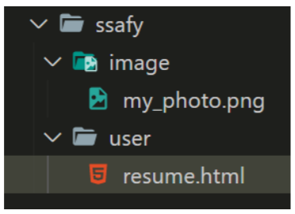
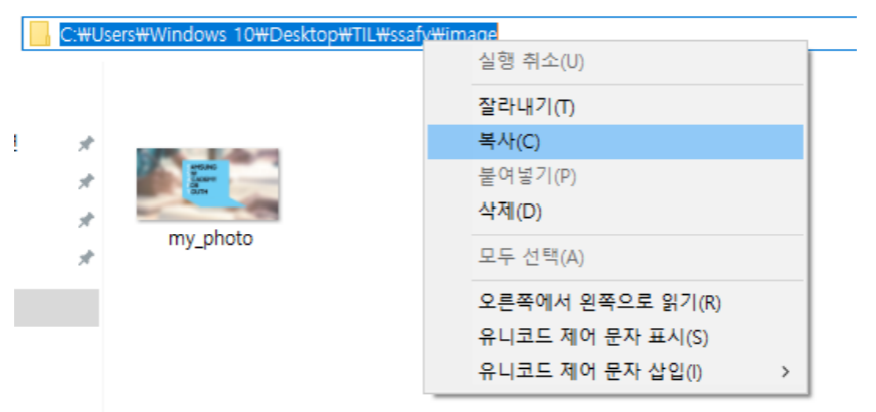

## 1. img tag

#### 아래 그림과 같은 폴더 구조가 있다. resume.html에서 코드를 작성 중일 때, image 폴더 안의 my_photo.png를 보여주는 \ tag를 작성하시오. 단, 이미지가 제대로 출력되지 않을 때는 ssafy 문자열이 출력 되도록 작성하시오.



폴더 경로는 다음과 같은 방법으로 확인 할 수 있다.



``` html
<a href="">
	
</a>
```


## 2. 파일 경로

####  위와 같이 경로를 __(a)__로 작성 할 시, github에 업로드 하거나 전체 폴더의 위치가 변경 되었을 때 이미지를 불러 올 수 없게 된다. 이를 해결 하려면 이미지 경로를 __(b)__ 로 바꾸어 작성하면 된다. __(a)__와 __(b)__에 들어갈 말과 __(b)__ 로 변경한 코드를 작성하시오.


a) 절대경로 

b) 상대경로


``` html
<a href="">
    
</a>    
```


## 3. Hyper Link

####  출력된 my_photo.png 이미지를 클릭하면 ssafy.com으로 이동하도록 하시오.

``` html
<a href='https://www.ssafy.com'>Ssafy</a>
  
</a>
```


## 4. 선택자

#### 1) 아래의 코드를 작성하고 결과를 확인 하시오.

``` html
<div id='ssafy'
  <h2>어떻게 선택 될까?</h2>
  <p>첫번째 단락</p>
  <p>두번째 단락</p>
  <p>세번째 단락</p>
  <p>네번째 단락</p>
</div>  
```

``` html
#ssafy >p:nth-child(2) {
	color: red;
}
```


#### 2) nth-child를 nth-of-type으로 변경하고 결과를 확인 하시오.

``` html
#ssafy >p:nth-of-type(2) {
	color: blue;
}
```


#### 3) 작성한 코드를 참고하여 nth-child()와 nth-of-type()의 차이점을 작성하시오

ssafy라는 id를 가진 태그의 두번째 자식이 p태그이면 해당 태그에 css를 적용해달라는 뜻이다. 만약 첫번째 자식이 p태그 두번째 자식이 span 세번째 자식이 p태그이면 적용이 안된다. 


ssafy라는 id를 가진 태그 자식들 중에 두번째로 나오는 p태그에 css 적용을 하는 것이다. 


1. element :nth-child(n)
   - 부모의 n번째 자식을 찾고 해당 element를 선택
   - 