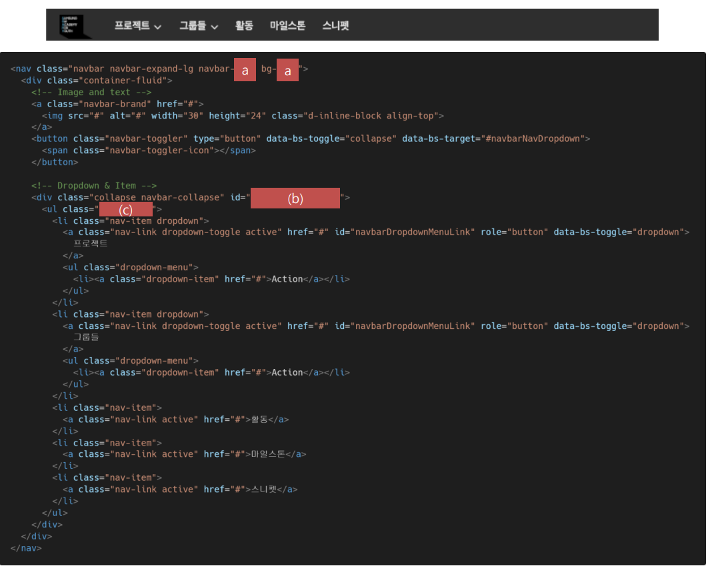

#  Bootstrap

Component를 활용하여 물음에 답하시오. 

#### 1) 각 문항에 제시된 이미지는 현재 lab.ssafy.com에서 사용중인 components이다. 제시된 요소에 사용된 Bootstrap Component 를 참고하여 빈칸을 작성하시오.

#### 1. Components

btn btn-success

#### 2. Components

a : light

b :  navbarSupportedContent

c: navbar-nav me-auto mb-2 mb-lg-0

#### 3. Components

a : pagination

b : disabled

c : active

