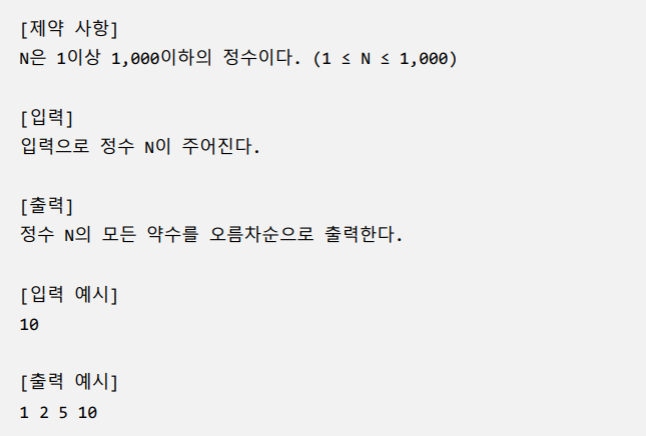

### 1. 간단한 N의 약수 (SWEA #1933) 

#### 입력으로 1개의 정수 N이 주어진다. 정수 N의 약수를 오름차순으로 출력하는 프로그램 을 작성하시오.



``` python
N = int(input())

for i in range(1, N+1):
    if N % i == 0:
        print(i, end=' ')
```

----


### 2. 중간값 찾기 (SWEA #2063 변형) 

#### 중간값은 통계 집단의 수치를 크기 순으로 배열 했을 때 전체의 중앙에 위치하는 수치를 뜻한다. 리스트 numbers에 입력된 숫자에서 중간값을 출력하라.


``` python
for i in range(len(numbers)):
    for j in range(i + 1, len(numbers)):
```

``` python
sorted_numbers = sorted(numbers)

length = 0 
for i in numbers:
    length += 1

center = length // 2
# center = len(sorted_numbers) // 2

```

----


### 3. 계단 만들기 

#### 자연수 number를 입력 받아, 아래와 같이 높이가 number인 내려가는 계단을 출력하시오.


``` python
N = int(input())
N = 4

for i in range (1. N+1):
    for j in range(1, i+1):
        print(j, end=' ')
```

