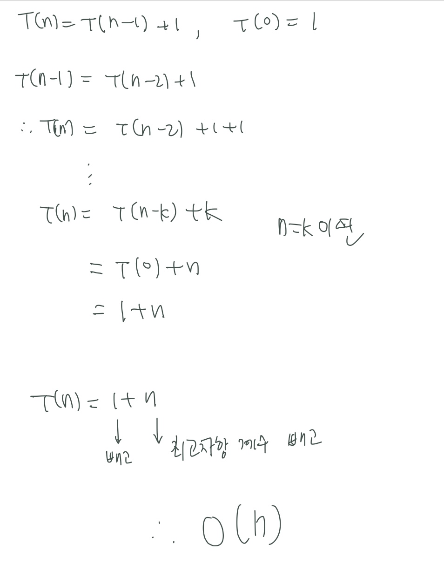
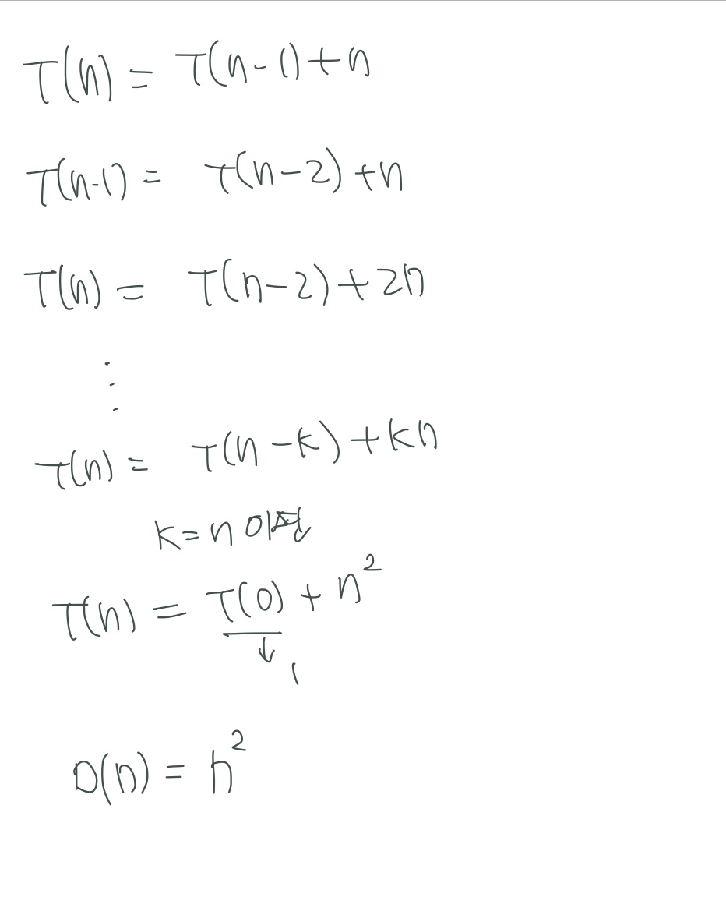

| Title          | Directory | 비고 |
| -------------- | --------- | ---- |
| 논리와 증명 12 |           |      |

### 문제 12:  n**2이 3의 배수이면 n은 3의 배수임을 증명하라 

n이 3의 배수가 아니면 n 제곱은 3의 배수가 아님 

n = 3k +1 

n제곱 = 9k**2 + 6k + 1 

3(3k**2 + 2k) + 1 -> 3의 배수가 아님 

결론 : n이 3의 배수가 아니면 n 제곱은 3의 배수가 아님 

-----

