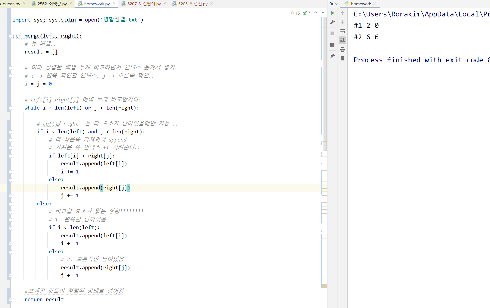
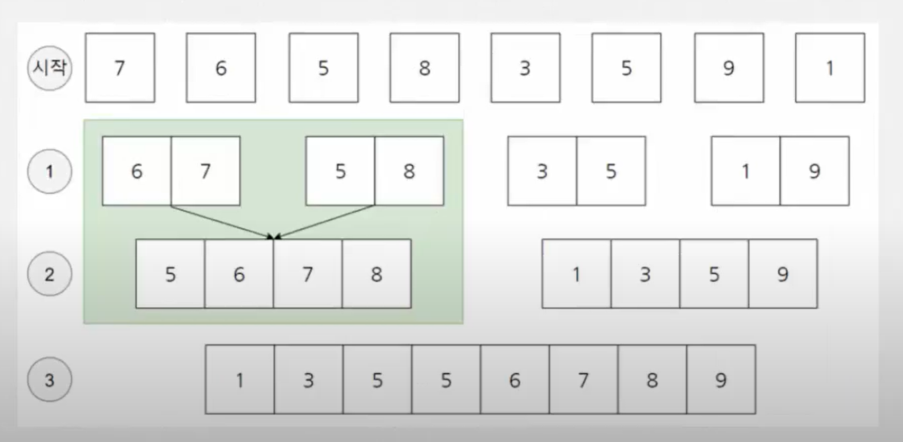

### 퀵정렬 

-  기준 데이터를 설정하고 그 기준보다 큰 데이터와 작은 데이터의 위치를 바꾸는 방법 
- 일반적인 상황에서 가장 많이 사용되는 알고리즘중 하나이다. 
- 병합 정렬과 더불어 대부분의 프로그래밍 언어의 정렬 라이브러리의 근간이 되는 알고리즘이다.
- 가장 기본적인 퀵 정렬은 첫번쨰 데이터를 기준 데이터(pivot)으로 설정합니다. 


5가 피벗, 왼쪽에서부터 5보다 큰 데이터를 선택 -> 7이 선택, 오른쪽에서 부터 5보다 작은 데이터를 선택 -> 4가 선택 

: 4와 7의 위치가 바뀜 


위치가 엇갈리는 경우 

피벗과 작은데이터의 위치를 서로 변경 


----

이렇게 되면 피벗을 기준으로 왼쪽에 있는 데이터는 모두 5보다 작고, 오른쪽에 있는 데이터는 모두 5보다 크다는 특징이 생김. 이렇게 피벗을 기준으로 데이터 묶음을 나누는 작업을 분할이라고 함.


다시 왼쪽에 있는 데이터를 상대로 퀵정렬 수행 

오른쪽 데이터 상대로 퀵정렬 수행 

재귀적으로 수행되며, 정렬될 때 마다 정렬되는 범위가 재귀적으로 점점 좁아지는 형태 

-----


### 퀵정렬 소스코드: 재귀 

```python
array = [5, 7, 9, 0, 3, 1, 6, 2, 4, 8]
def quick_sort(array, start, end):
    if start >= end: #원소가 한개라는 뜻
        return #함수 종료
    pivot = start
    left = start + 1
    right = end
    while(left <= right):
        #피벗보다 큰 데이터를 찾을때 까지 반복
        while(left<= end and array[left] <= array[pivot]):
            left += 1
        #피벗보다 작은 데이터를 찾을때 까지 반복
        while(right > start and array[right] >= array[pivot]):
            right -= 1

        if left > right: #엇갈렸다면 작은 데이터와 피벗을 교체
            array[right], array[pivot] = array[pivot], array[right]

        else: #엇갈리지 않았다면 작은 데이터와 큰 데이터를 교체
            array[right], array[left] = array[left], array[right]

    #분할 이후 왼쪽 부분과 오른쪽 부분에서 각각 정렬 수행
    quick_sort(array, start, right -1)
    quick_sort(array, right +1, end)

print(array) #[5, 7, 9, 0, 3, 1, 6, 2, 4, 8]
quick_sort(array, 0, len(array) - 1)
print(array) # [0, 1, 2, 3, 4, 5, 6, 7, 8, 9]
```

-----


### 퀵 정렬 소스코드 : pythonic

```python
array = [5, 7, 9, 0, 3, 1, 6, 2, 4, 8]
def quick_sort(array):
    #리스트가 하나 이하의 원소만을 담고 있다면 종료
    if len(array) <= 1:
        return array
    #피벗은 첫번째 원소
    pivot = array[0]
    # 피벗을 제외한 리스트
    tail = array[1:]

    left_side = [x for x in tail if x <= pivot] #분할된 왼쪽 부분
    right_side = [x for x in tail if x > pivot] #분할된 오른쪽 부분

    # 분할 이후 왼쪽 부분과 오른쪽 부분에서 각각 정렬 수행하고 전체 리스트 반환
    return quick_sort(left_side) + [pivot] + quick_sort(right_side)

print(quick_sort(array))
```

-----


### 병합정렬 

- 대표적인 분할정복 방법을 채택한 알고리즘임 
- 결과적으로 퀵 정렬과 동일하게 O(N * logN)의 시간복잡도를 가짐
- 그러나 취악의 경우에는 O(N^2)의 복잡도를 가지는 퀵정렬과는 달리, 병합정렬은 일단 반으로 쪼개고 나중에 합쳐서 정렬하기 때문에 O(N * logN)의 복잡도를 가짐 

- 병합정렬은 퀵정렬과 다르게 피벗 값이 없고, 항상 반으로 나눈다는 특징이 있다. 이 특징이 이 단계의 크기가 NlogN이 되도록 만들어준다. 




첫번째 단계 : 2^1씩 확인 

두번째 단계 : 2^2씩 확인 

세번째 단계 : 2^3씩 확인 

log8 = 3이기 때문에 3단계로 이루어짐 

3 * 8 = logn * n 

