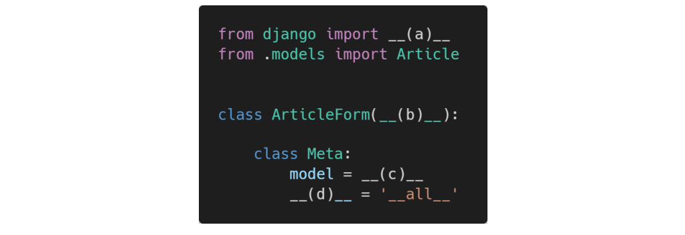

### 1. 각 문항을 읽고 맞으면 T, 틀리면 F를 작성하시오. 

1. ModelForm을 사용할 때 Meta 클래스 내부에 model과 fields 변수는 반드시 작성해야 한다. 

   T

2.  ModelForm을 사용할 때는 렌더링 되는 input element 속성은 Django에서 제공 해주는 대로만 사용해야 한다. 

   F

   form 설정시 widget이란게 있었다. 

   예를 들어 input 태그에 class, placeholder, required, maxlength

3.  화면에 나타나는 각 element 위치는 html에서 form.as_p()를 사용하지 않아도 직접 위치시킬 수 있다.

   T

   form.title, form.contene 등 각 필드를 직접 불러와서 사용하는 방법 

   view에서 넘겨 받은 form을 DTL로 for문을 사용하여 각 요소들을 직접 위치시킬수도 있었다. 

   ----

   

### 2. 다음 빈칸 (a) ~ (d) 에 적합한 코드를 작성하시오.

a. form

b.forms.Modelforn

c:article 

d=fields

