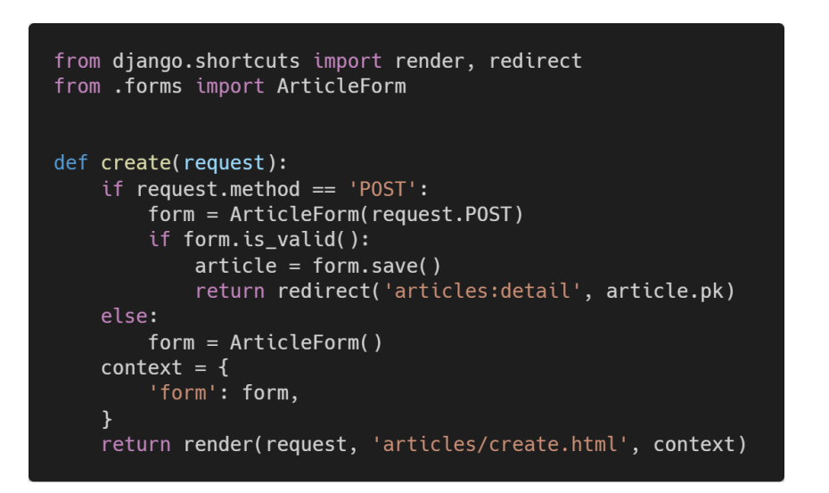

아래 작성된 views.py의 코드 일부를 보고 문제에 알맞은 답을 서술하시오

1. 왜 변수 context는 if else 구문과 동일한 레벨에 작성 되어있는가?

- 게시글 생성 POST 요청이 유효성 검사를 통과하지 못했을 떄, 통과하지 못한 데이터를 포함한 form을 create.html에 보내서 사용자에게 다시 글을 작성하도록 하기 위해 

- form 인스턴스는 에러메세지도 함께 가지고 있기 떄문에 어떤 부문에서 문제가 발생하였는지도 알려줄 수 있음.

2. 왜 request의 http method는 POST 먼저 확인하도록 작성하는가?

- POST 요청이 들어왔을 떄만 db 조작할 수 있도록 관련 로직이 동작하도록 하고, POST 메서드가 아닌 다른 메서드들ㅇ느 서버 내부에 영향을 미치지 않는 빈폼을 넘겨주도록 한다. 