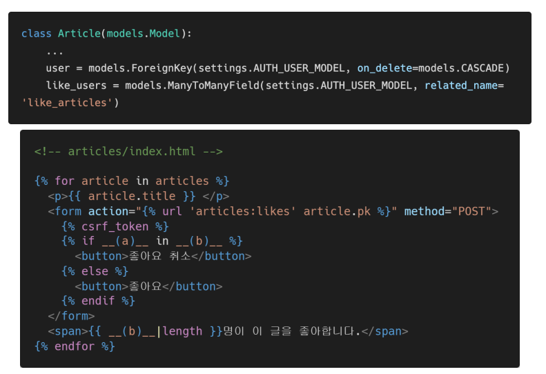
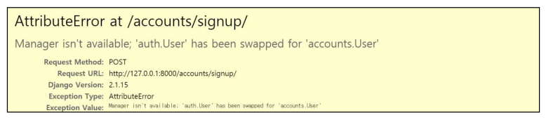
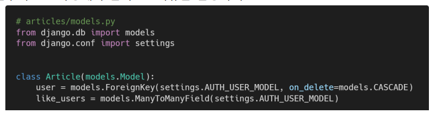
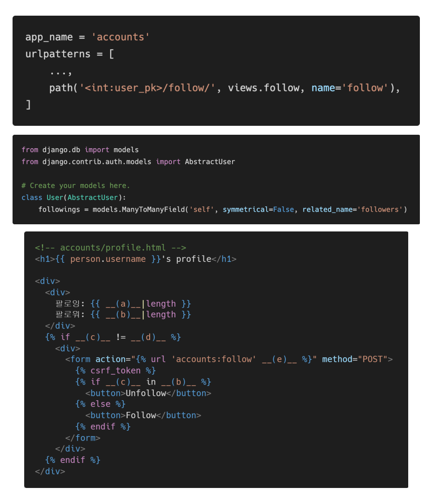

# HomeWork
### M:N True or False

각 문항을 읽고 맞으면 T, 틀리면 F를 작성하고, 틀렸다면 그 이유도 함께 작성하시오.

1) Django에서 1:N 관계는 ForeignKeyField를 사용하고, M:N 관계는 ManyToManyField를 사용한다.
   -  True
2) ManyToManyField를 설정하고 만들어지는 테이블 이름은 “앱이름_클래스이름_지정한 필드이름”의 형태로 만들어진다.

​			- True


3. ManyToManyField의 첫번째 인자는 참조할 모델, 두번째 인자는 related_name이 작성 되는데 두 가지 모두 필수적으로 들어가야 한다.
   - False


### Like in templates

아래 빈 칸 (a)와 (b)에 들어갈 코드를 각각 작성하시오.



ariticle과 user가 1대 N임 , 밑에 N:M이 있음. 

A : user(or request.user)

B : article.like_users.all


### Follow in views

모델 정보가 다음과 같을 때 빈칸 a, b, c, d, e에 들어갈 코드를 각각 작성하시오.


a : user_pkod

b : followers

c : filter

d : remove

e : add


### User AttributeError

다음과 같은 에러 메시지가 발생하는 이유와 이를 해결하기 위한 방법과 코드를 작성하시오.



usercreationform이 auth.user모델을 참조하고 있는데 해당 유저 모델이 변동하였으므로 문제가 발생하였다.

이를 해결하기 위해선 usercreationform을 상속받은 새 modelform으로 대체해야한다. 

```python
from django.contrib.auth.forms import UserCreationForm
from django.contrib.auth import get_user_model

class CustomUserCreationForm(UserCreationForm):
    
    class Meta(UserCreationForm.Meta):
        model = get_user_model()
        fields = UserCreationForm.Meta.fields
```


### related_name

아래의 경우 ForeignKey 혹은 ManyToManyField에 related_name을 필수적으로 작성해야 한다. 그 이유를 설명하시오. 



article과 User가 이미 1:N관계를 맺고 있으므로, User는 자신에게 없는 Article에 대한 정보를 article_set이라는 매니저를 통해서 받아오고 있었다.

그런데 like_user라는 필드로 article과 User가 M:N 관계를 맺게 되몀 마찬가지고 User는 자신에게 없는 article에 대한 M:N정보만 가지고 오기 위해서 article_set 이라는 매니저를 사용하여야 한다.

이과정에서 두 article_set 매니저의 이름이 충돌하게 되므로 구분짓기 위하여 related_name을 정의 하여야 한다. 


6. follow templates person 

변수에는 view함수에서 넘어온 유저 정보가 담겨 있고, 모델 정보가 아래와 같을 때 빈칸 a, b, c, d, e에 들어갈 알맞은 코드를 각각 작성하시오.




a : person.following.all

b : person.followers.all

c : user ( or request.user)

d : person

e : person.pk

