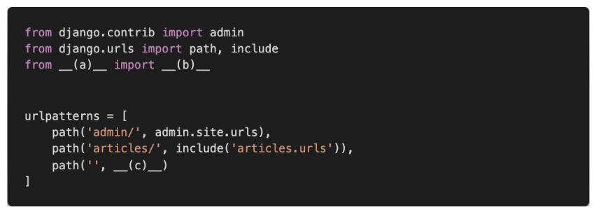

# HomeWork
### MTV

Django는 MTV로 이루어진 Web Framework다. MTV가 무엇의 약자이며 Django에서 각각 어떤 역할을 하고 있는지 작성하시오.

- model

  - 데이터 베이스 관리 
  - 응용 프로그램의 데이터 구조를 정의하고 데이터베이스의 기록을 관리

- template

  - 인터페이스, 화면
  - 파일의 구조나 레이아웃을 정의
  - 실제 내용을 보여주는 데 사용

- view

  - 중앙 컨트롤러
  - http 요청을 수신 http 응답을 반환
  - model을 통해서 요청을 충족시키는 데이터에 접근 
  - template에게 응답의 서식을 맡김 

  

### 404 Page not found

기본적으로 ‘/ ’ 페이지에 접속하게 되면 아래 사진처럼 Page not found 에러가 발생한다. ‘/ ’ 페이지에 접속했을 때 index.html를 렌더링 하고자 한다. 아래 빈칸에 알맞은 코드를 작성하시오. (프로젝트의 이름은 crud 이며 app 이름은 articles이다. index.html 파일을 렌더링 하는 view 함수의 이름은 index라고 가정한다.)




a : .

b : views

c : views.index + name='index'

### templates and static

Django 프로젝트는 기본적으로 render 할 html과 같은 template 파일과 css, js와 같은 static 파일을 앱 폴더 내부의 templates와 static 이름의 폴더에서 찾는다. 만약 해당 위치가 아닌 임의의 위치에 파일을 위치 시키고 싶으면 __(a)__ 파일의 __(b)__와 __(c)__ 라는 변수에 담긴 리스트의 요소를 정의하면 된다. 
빈칸 (a), (b), (c)에 들어갈 내용을 작성하시오.

a : settings.py

b : templates

c : STATICFILES_DIRS


### migration

아래는 그림과 같이 Django에서 선언한 Model을 Database에 반영하는 과정에서 사용하는 명령어에 대한 설명이다. 각 설명에 해당하는 명령어를 작성하시오. (app 이름은 articles이다.)


1) 마이그레이션 생성 - makemigrations
2) 마이그레이션 DB 반영 여부 확인 - showmigrations articles
3) 마이그레이션에 대응되는 SQL문 출력 - sqlmigrate articles<migration-name> 
4) 마이그레이션 파일의 내용을 DB에 최종 반영 - {articles}


### ModelForm True or False

각 문항을 읽고 맞으면 T, 틀리면 F를 작성하시오.

1. POST와 GET 방식은 의미론상의 차이이며 실제 동작 방식은 동일하다.

     - false  : 데이터를 전달하는 body유무가 다름.

     - post요청은 body에 get요청은 params에 데이터를 담아서 전달

     

2. ModelForm과 Form Class의 핵심 차이는 Model의 정보를 알고 있는지의 여부이다.

     - True

3) AuthenticationForm은 User 모델과 관련된 정보를 이미 알고 있는 ModelForm으로
    구성되어 있다.
    
    - falae : 
    
4. ModelForm을 사용할 때 Meta 클래스에 fields 관련 옵션은 반드시 작성해야 한다

     - True


### media 파일 경로

사용자가 업로드한 파일이 저장되는 위치를 Django 프로젝트 폴더(crud) 내부의 /uploaded_files 폴더로 지정하고자 한다. 이 때, settings.py에 작성해야 하는 설정 2가지를 작성하시오.

```python
#settings.py

#사용자가 업로드 한 파일을 보관할 폴더의 절대 파일 시스템 경로
 MEDIA_ROOT = BASE_DIR / 'pjt_name' / 'uploaded_files'
    
# MEDIA_ROOT에서 제공되는 미덩 파일을 처리하는 URL
MEDIA_URL = '/media/'
```


### DB True or False

각 문항을 읽고 맞으면 T, 틀리면 F를 작성하시오.

1) RDBMS를 조작하기 위해서 SQL문을 사용한다.
   - True
2) SQL에서 명령어는 반드시 대문자로 작성해야 동작한다.
   - False
   - 기본적으로는 대소문자 구분 않고 작동
3) 일반적인 SQL문에서는 세미콜론( ; )까지를 하나의 명령어로 간주한다.
   - True
4) SQLite에서 .tables, .headers on과 같은 dot( . )로 시작하는 명령어는 SQL문이 아니다.
   - True
5) 하나의 데이터베이스 안에는 반드시 한 개의 테이블만 존재해야 한다.
   - False

### on_delete

게시글과 댓글의 관계에서 댓글이 존재하는 게시글은 삭제할 수 없도록 즉, ProtectedError를 발생시켜 참조 된 객체의 삭제를 방지하는 __(a)__를 작성하시오.


PROTECT

restrict는 restrictederror가 발생

### Like in models

Article 모델과 User 모델을 M:N 관계로 설정하여 ‘좋아요’ 기능을 구현하려고 한다. __(a)__와 __(b)__에 들어갈 내용을 작성하시오. 


a : 'ManyToManyField'

b : related_name

### Follow in models

follow 기능을 구현하기 위해 accounts app의 models.py에 아래와 같은 모델을 작성하였다. Migration 작업 이후에 Database에 만들어지는 중개 테이블의 이름을 작성하고 이 테이블의 id를 제외한 컬럼 이름을 각각 작성하시오.


- accounts_user_followings
- from_user_id, to_user_id