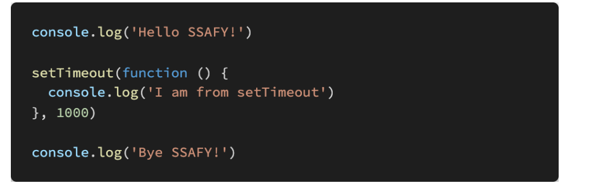

아래의 설명을 읽고 T/F 여부를 작성하시오. 

- Event Loop는 Call Stack이 비워지면 Task Queue의 함수를 Call Stack으로 할당하는 역할을 한다. 
  - true

-  XMLHttpRequest(XHR)는 AJAX 요청 instance를 생성하는 Web API이다. XHR객체를 활용하여 브라우저와 서버 간의 네트워크 요청을 전송할 수 있다. 
  - true
-  axios는 XHR(XMLHttpRequest)을 보내고 응답 결과를 Promise 객체로 반환해주는 라이브러리이다.
  - true

아래의 코드가 실행되었을 때 Web API, Task Queue, Call Stack 그리고 Event Loop에서 어떤 동작이 일어나는지 서술하시오

Hello SSAFY

Bye SSAFY 

1초 후에 I am from setTimeout

callstack -> webAPI -> task Queue -> event loop를 통해서 call stack이 비었을 때 선입 선출 되어 call 스택으로 할당