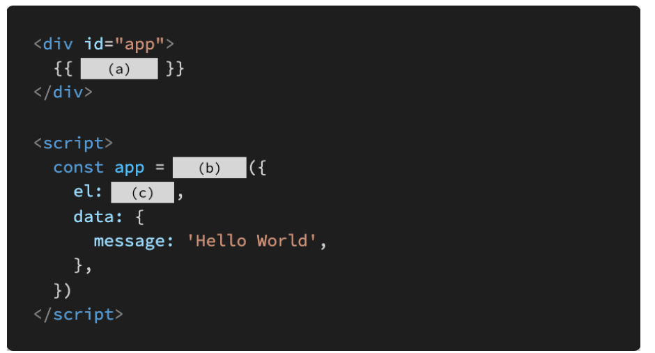

• SPA는 Single Pattern Application의 약자이다. 

- false : single page application

 SPA는 웹 애플리케이션에 필요한 모든 정적 리소스를 한 번에 받고, 이후부터는 페이지 갱신에 필요한 데이터만 전달받는다. 

• Vue.js에서 말하는 ‘반응형’은 데이터가 변경되면 이에 반응하여, 연결된 DOM이 업데이트되는 것을 의미한다. 

True

• 동일한 요소에 v-for와 v-if 두 디렉티브가 함께 작성된 경우, 매 반복 시에 v-if의 조건문으로 요소의 렌더링 여부를 결정한다.

 • v-bind 디렉티브는 “@“, v-on 디렉티브는 “:” shortcut(약어)을 제공한다. 

- True

• v-model 디렉티브는 input, textarea, select 같은 HTML 요소와 단방향 데이터 바인딩을 이루기 때문에 v-model 속성값의 제어를 통해 값을 바꿀 수 있다

- True

2. MVVM은 무엇의 약자이고, 해당 패턴에서 각 파트의 역할은 무엇인지 간단히 서술하시오.

- #### Model

  - Vue에서 Model은 javascript Object이다

  - Object === {key: value}

  - Model은 Vue Instance내부에서 data라는 이름으로 존재

  - 이 data가 바뀌면 view(DOM)가 반응 

    

- #### view

  - vue에서 view는 DOM(HTML)이다
  - data의 변화에 따라서 바뀌는 대상

- #### viewModel

  - vue에서 viewModel은 모든 Vue Instance이다
  - view와 Model사이에서 Data와 Dom에 관련된 모든 일을 처리 
  - ViewModel을 활용해 Data를 얼마만큼 잘 처리해서 보여줄것인지(DOM)을 고민하는 것 

.3. 다음의 빈칸 (a), (b), (c)에 들어갈 코드를 작성하시오.

a : message

b : new Vue

c : #app