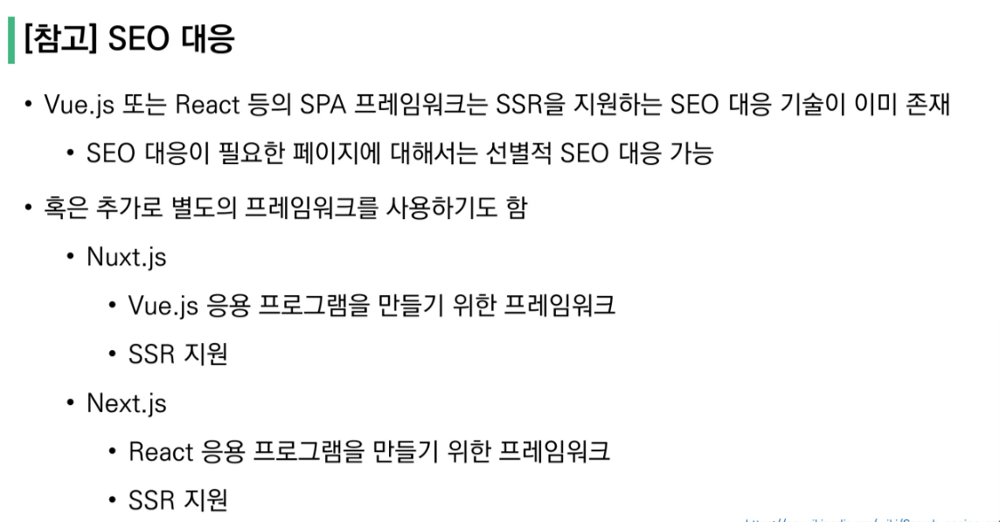
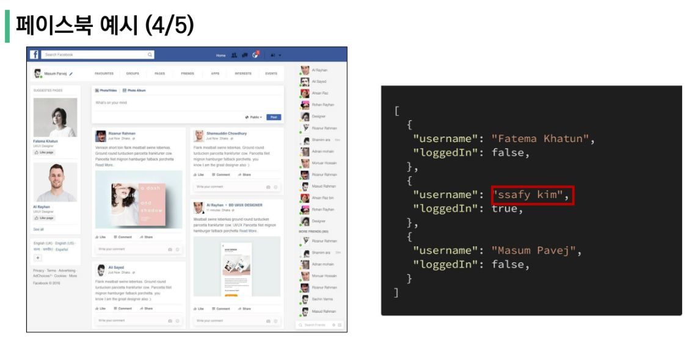

### Vue.js

Front-End development

- HTML, CSS 그리고 JavaScript를 활용해서 데이터를 볼 수 있게 만들어줌 

  - 이 작업을 통해 사용자(User)는 데이터와 상호작용(interaction)할 수 있음 

    

- 대표적인 프론트엔드 프레임워크

  - Vue.js, React, Angular

- 사용자 인터페이스를 만들기 위한 진보적인 자바스크립트 프레임워크
- 현대적인 tool과 다양한 라이브러리를 통해 SPA(single page application)를 완벽하게 지원

- Evan You에 의해 발표
  - 구글의 Angular 개발자 출신
  - 구글 Angular보다 더 가볍고 간편하게 사용할 수 있는 프레임워크를 만들기 위해 개발

----

### SPA

- single Page Application(단일 페이지 어플리케이션)
- 현재 페이지를 동적으로 렌더링함으로써 사용자와 소통하는 웹 어플리케이션 

- 단일 페이지로 구성되며 서버 최초에만 페이지를 다운로드하고 이후에는 동적으로 DOM을 구성
  - 처음 페이지를 받은 이후 부터는 서버로부터 전체 페이지를 불러오는 것이 아닌 현재 페이지 중 필요한 부분만 동적으로 다시 작성함
- 연속되는 페이지같의 사용자 경험을 향상
  - 모바일 사용량이 증가하고 있는 현제, 트래픽의 감소와 속도, 사용성, 반응성의 향상은 매우 중요하기 때문
- 동작 원리의 일부가 CSR(Client Side Rendering)의 구조를 따름

### SPA의 등장 배경

- 과거 웹사이트들은 요청에 따라 매번 새로운 페이지를 응답하는 방식이었음
  - MPA(multi Page Application)
- 스마트폰이 등장하면서 모바일 최적화의 필요성이 대두됨
  - 모바일 네이티브 앱과 같은 형태의 웹페이지가 필요해짐 
- 이러한 문제를 해결하기 위해 vue.js 와 같은 프론트에니드 프레임워크가 등장
  - CSR, SPA의 등장
- 1개의 웹페이지에서 여러 동작이 이루어지며 모바일 앱과 비슷한 형태의 사용자경험을 제공

---

### CSR

- client side rendering
- 서버에서 화면을 구성하는 SSR방식과 달리 클라이언트에서 화면을 구성
- 최초요청시 HTML, CSS, JS등 데이터를 제외한 각종 리소스를 응답받고 이후 클라이언트에서는 필요한 데이터만 요청해 JS로 DOM을 렌더링하는 방식
- 즉, 처음엔 뼈대만 받고 브라우저에서 동적으로 DOM을 그림 
- SPA가 사용하는 렌더링 방식

**장점**

1. 서버와 클라이언트 간 트래픽 감소
   - 웹 애플리케이션에 필요한 모든 정적 리소스를 최초에 한 번 다운로드 후 필요한 데이터만 갱신
2. 사용자 경험(UX)향상
   - 전체 페이지를 다시 렌더링하지 않고 변경되는 부분만 갱신하기 때문 

**단점**

1. SSR에 비해 전체 페이지 최종 렌더링 시점이 느림
2. SEO(검색 엔진 최적화)에 어려움이 있음(최초 문서에 마크업이 없기 때문)

---

### SSR

- server side rendering
- 서버에서 클라이언트에게 보여줄 페이지를 모두 구성하여 전달하는 방식
- JS 웹 프레임워크 이전에 사용되던 전통적인 렌더링 방식

**장점**

1. 초기 구동 속도가 빠름 
   - 클라이언트가 빠르게 컨텐츠를 볼 수 있음 
2. SEO(검색 엔진 최적화)에 적합 
   - DOM에 이미 모든 데이터가 작성되어 있기 때문

**단점**

1. 모든 요청마다 새로운 페이지를 구성하여 전달
   - 반복되는 전체 새로고침으로 인해 사용자 경험이 떨어짐
   - 상대적으로 트래픽이 많아 서버의 부담이 클 수 있음

----

### SSR과 CSR

- 두 방식의 차이는 최종 HTML 생성 주체가 누구인가에 따라 결정

- 즉 실제 브라우저에 그려질(렌더링) HTML을 서버가 만든다면 SSR, 클라이언트가 만든다면 CSR

  

- SSR과 CSR을 단순 비교하여 어떤 것이 더 좋다가 아니라 내 서비스 또는 프로젝트 구성에 맞는 방법을 적절하게 선택하는 것이 중요

- 예를 들어, Django에서 Axios를 활용한 좋아요 팔로우 로직의 경우 대부분은 Server에서 완성된 HTML을 제공하는 구조(SSR)

- 단 특정 요소(좋아요, 팔로우)만 JS(AZAX & DOM조작)을 활용(CSR)
  - AJAX를 활용해 비동기 요청으로 필요한 데이터를 클라이언트에서 서버로 직접 요청을 보내 받아오고 JS를 활용해 DOM을 조작 

----

---

### Why vue?

왜 사용할까?

- 현대 웹 페이지는 페이지 규모가 계속해서 커지고 있으며, 그만큼 사용하는 데이터도 늘어나고, 사용자와의 상호작용도 많이 이루어짐 

- 결국 Vanilla JS만으로는 관리하기 어려움 
  - 페이스북 친구가 이름 수정하면 따라서 수정해야하는게 많다
  - 페이스북이 React를 개발한 이유

### Django 좋아요 with Vanilla JS 예시 

----

### 비교

#### Vanilla JS

- 한 유저가 작성한 게시글이 DOM 상에 100개 존재
- 이 유저가 닉네임을 변경하면, DB의 UPDATE와 별도로 DOM상의 100개 작성자의 이름이 모두 수정되어야 함
- 모든 요소를 선택해서 이벤트를 등록하고 값을 변경해야 함 

#### Vue.js

- DOM과 data가 연결되어 있고, data를 변경하면 이에 연결된 DOM은 알아서 변경 
- 즉, 우리가 신경써야 할 것은 오직 Data에 대한 관리(Developer Exp 향상)

---

### Concepts of Vue.js

#### MVVM Pattern

- 애플리케이션 로직을 UI로 부터 분리하기 위해 설계된 디자인 패턴
- 구성 요소 
  1. Model
  2. View
  3. View Model

---

#### MVVM

- #### Model

  - Vue에서 Model은 javascript Object이다

  - Object === {key: value}

  - Model은 Vue Instance내부에서 data라는 이름으로 존재

  - 이 data가 바뀌면 view(DOM)가 반응 

    

- #### view

  - vue에서 view는 DOM(HTML)이다
  - data의 변화에 따라서 바뀌는 대상

- #### viewModel

  - vue에서 viewModel은 모든 Vue Instance이다
  - view와 Model사이에서 Data와 Dom에 관련된 모든 일을 처리 
  - ViewModel을 활용해 Data를 얼마만큼 잘 처리해서 보여줄것인지(DOM)을 고민하는 것 

----

