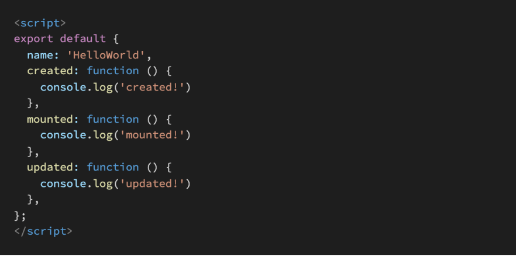

아래의 설명을 읽고 T/F 여부를 작성하시오. 

- Vue의 Life Cycle Hook에서 created Hook은 Vue template에 작성한 요소들이 DOM에 모두 그려지는 시점에 실행된다.
  - false
  - create hook
    - vue instance가 생성되는 시점 
  - mounted hook 
    - vue instance가 dom에 부착되는 시점 
-  npm은 Node Package Manager의 약자이며, npm을 통해 설치한 package 목록은 package.json 파일에 자동으로 작성된다. 
- Vue CLI를 통해 만든 프로젝트는 브라우저가 아닌 node.js 환경이기 때문에 DOM 조작이나 Web API 호출 등 Vanilla JS에서의 기능을 사용할 수 없다.
  - False

 Vue Router에서 설정하는 history mode가 무엇을 뜻하는지 서술하시오.

hash 모드가 존재

- 경로가 root:8080/#/About/ 형태임

- #뒤는 변화 감지 안함 

- 하지만 안예쁨 사용자 선호도 안함
- 

그래서 history 모드 사용

- HTML 5 history API(Web API)

- history.go()

  

3. Vue Life Cycle Hook을 참고하여, 다음 Vue application을 실행했을 때, console 창에 출력되는 메시지를 작성하시오.

created

mounted

---

updated는 데이터에 변화가 생겼을 때 보여줌

increase number 하면 호출됨 

