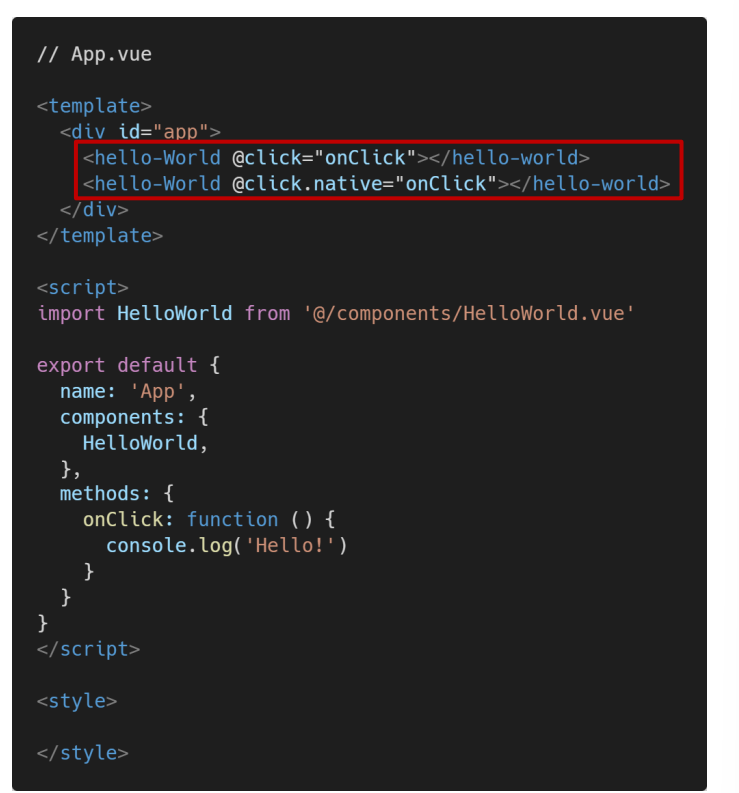
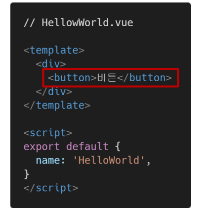
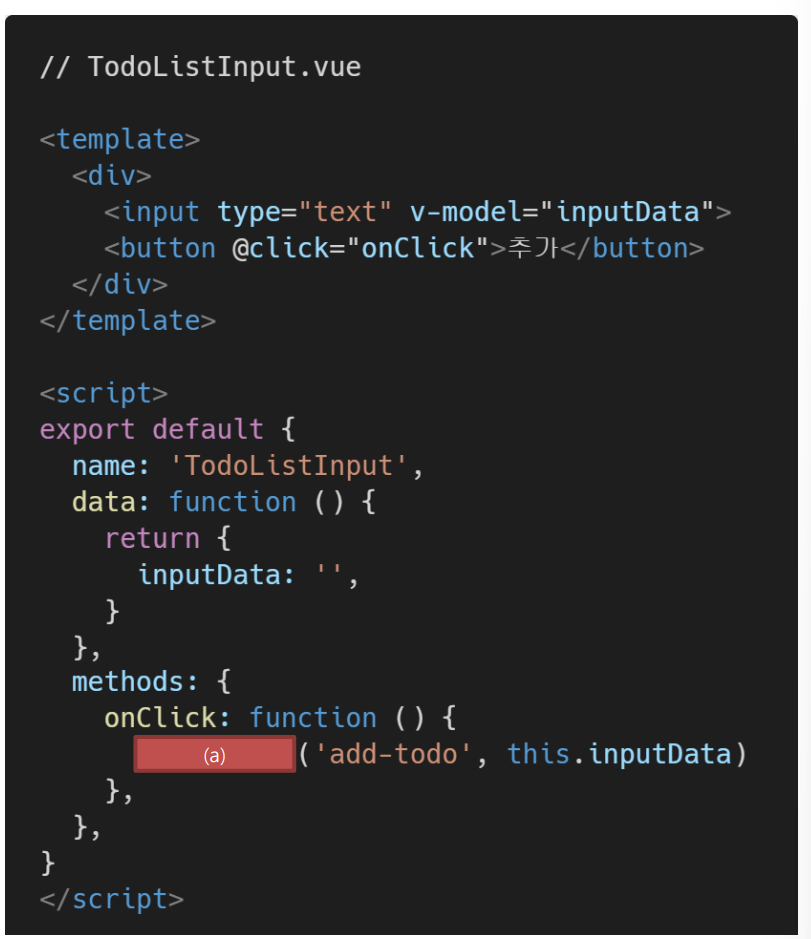
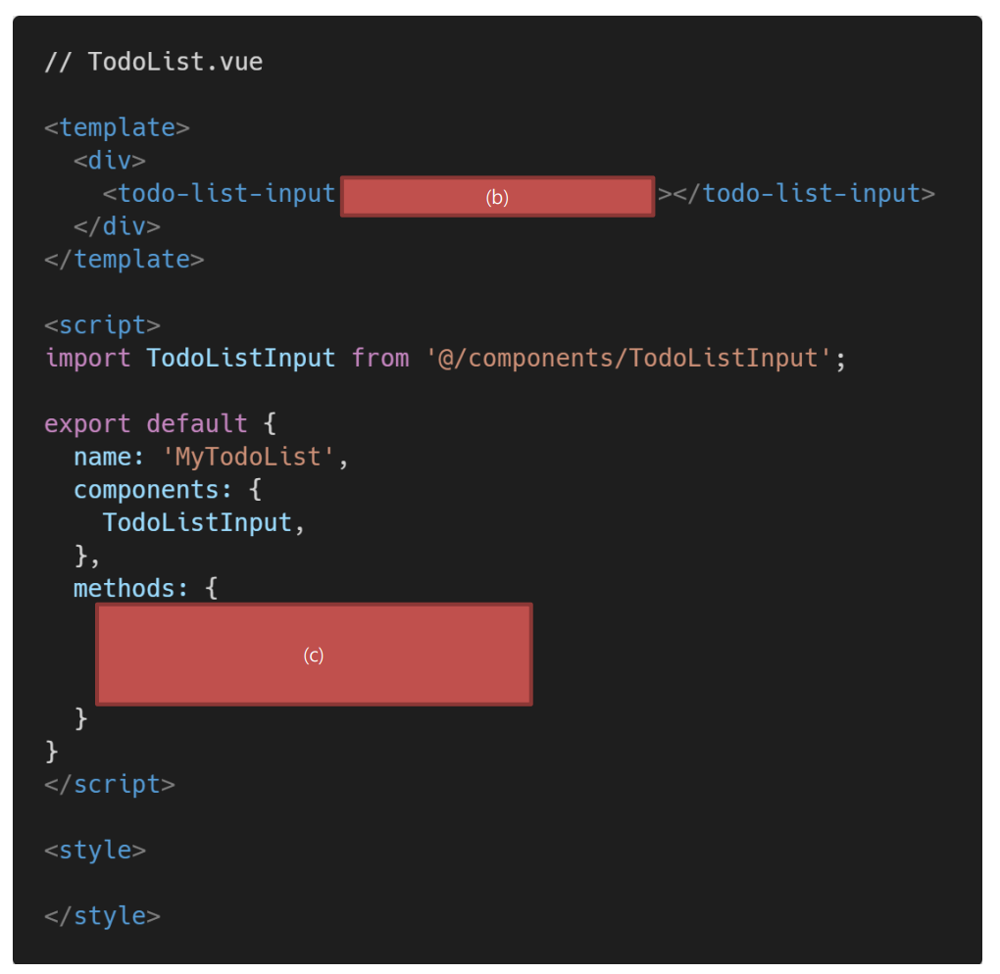

. 아래의 설명을 읽고 T/F 여부를 작성하시오. 

Vue는 컴포넌트 간 양방향 데이터 흐름을 지향하기 때문에 부모, 자식 컴포넌트 간의 데이터 전달 및 수정이 자유롭다. 

- False

  - 단방향 데이터 흐름 지향 : 상위 -> 하위컴포넌트는 수월하지만 하위에서 상위로 데이터 전달은 $emit을 통해서 이벤틀르 발생시키도록 하고, 하위 컴포넌트에서 이벤트가 발생하는 것을 대기하고 있던 상위 컴포넌트는 그렇게 전달받은 변경된 데이터의 주체를 가지고 있다.

    

v-on 디렉티브는 해당 요소 또는 컴포넌트에서 특정 이벤트 발생 시 전달받은 함수를 실행한다. 

- True

  

부모 컴포넌트는 props를 통해 자식 컴포넌트에게 이벤트를 보내고, 자식 컴포넌트는 emit을 통해 부모 컴포넌트에게 데이터를 전달한다.

- False

Vue는 단방향 데이터 흐름을 지향하는 프론트엔드 프레임워크다. 공식문서를 참고하여 그 이유를 서술하시오

- 양방향 데이터흐름이라고 하였을 때, 하위 컴포넌트가 변경한 데이터가 상위 컴포넌트에도 영향을 미치고, 이로 인해서 같은 데이터를 받아서 사용하고 있는 다른 하위컴포넌트의 데이터도 변경되는 상황이 발생할 수 있다. 

- 데이터의 흐름을 파악하는 것도 어려워진다. 

Native

아래와 같은 Vue 프로젝트에서 2개의 버튼이 동작하는 것을 비교하여 .native 수식어의 역할을 작성하시오.

버튼이 클릭 되었다는 이벤트가 발생했을 때 그걸 직접 상위컴포넌트에서 볼 수있음

4. 다음은 자식 컴포넌트에서 이벤트를 발생시켜 부모 컴포넌트의 함수를 실행하는 코드이다. 빈칸 (a), (b), (c)에 들어갈 코드를 작성하시오. 

   • TodoListInput 컴포넌트의 버튼을 누르면 add-todo 이벤트가 발생한다. (이벤트 발생 시 data의 inputData 값도 함께 전달한다.) • TodoList 컴포넌트에서 add-todo 이벤트를 청취하면, onAddTodo 메서드를 실행한다. • onAddTodo 메서드에서는 TodoListInput 컴포넌트에서 전달받은 값을 console.log 함수를 통해 출력한다.

a : this.$emit

b : @add-todo="onAddTodo"

c : onAddTodo(todo){

console.loge(todo)}

