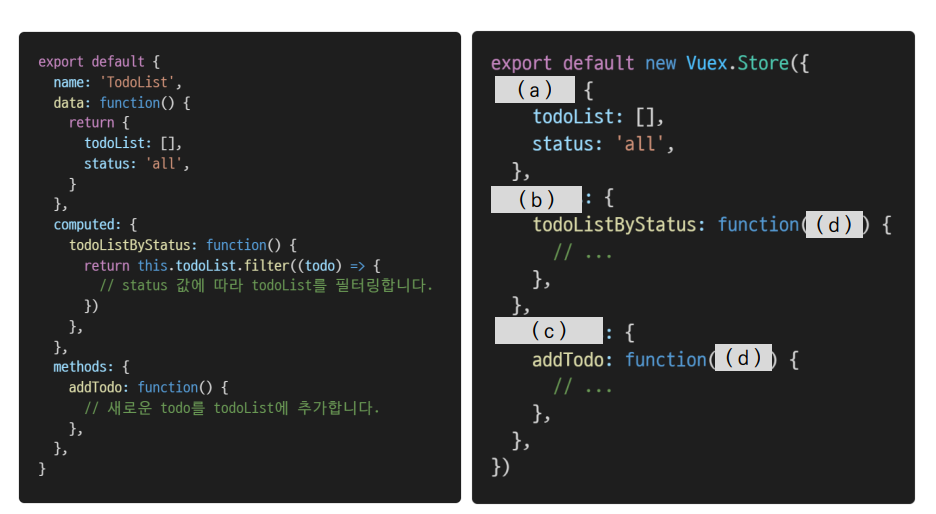

1. 아래의 설명을 읽고 T/F 여부를 작성하시오

- Vue 프로젝트에서 상태 관리를 하기 위해서는 반드시 Vuex를 설치해야 한다. 

- - FALSE

- - 내 프로젝트가 충분히 크고 데이터가 복잡한 흐름을 가지고 있다면 VUEX도입을 고려해봐야한다. 

- - 규모가 작은 프로젝트임에도 단방향 데이터 흐름이 복잡하게 얽히게 되는 경우 이벤트 버스 도입을 고려해볼 수 있다.

- mutations는 반드시 state를 수정하기 위해서만 사용되어야 한다. 

  - TRUE

  

- mutations는 store.dispatch로, actions는 store.commit으로 호출할 수 있다. 
  - FALSE 
  - actions 가 dispatch, mutations가 commit
- state는 data의 역할, getters는 computed와 유사한 역할을 담당한다.
  - TRUE

Vuex에서 State, Getters, Mutations, Actions의 역할을 각각 서술하시오.

state : 곧 데이터이며 해당 애플리케이션의 핵심이 되는 요소 

getters : state를 변경하지 않고 활용하여 계산을 수행

action : view에서 사용자 입력에 대해 반응적으로 state를 바꾸는 방법

Mutations : 실제로 state를 변경하는 유일한 방법

컴포넌트에 작성된 Todo App 관련 코드를 Vuex의 Store로 옮기고자 한다. 빈 칸 (a), (b), (c), (d)에 들어갈 코드를 작성하시오

a : state

b : getters

c : mutations / actions

d :context or state